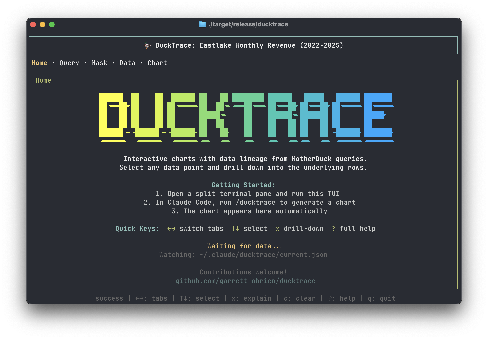

# DuckTrace

Interactive charts with data lineage — select any data point to drill down into the underlying rows.



DuckTrace is a [Claude Code](https://claude.ai/code) skill paired with a Rust TUI. You talk to Claude, Claude queries [MotherDuck](https://motherduck.com/), and the results appear in a terminal dashboard where you can explore the data interactively.

## How It Works

DuckTrace has two parts that work together:

**The Skill** runs inside Claude Code. When you ask Claude to visualize data, it queries MotherDuck via MCP, then writes the results to a shared JSON file (`~/.claude/ducktrace/current.json`). The skill also generates a drill-down query template so you can inspect individual data points later.

**The TUI** runs in a separate terminal pane. It watches the JSON file and auto-refreshes whenever Claude generates new data. From the TUI you can browse the SQL query, inspect the column mapping, scroll through the data table, and view a chart — all without leaving the terminal. Select any data point and press `x` to drill down: the TUI queries MotherDuck directly and shows the underlying rows in a sortable overlay.

The two sides communicate through the filesystem — no server, no ports, no configuration beyond a MotherDuck token.

```
┌─────────────────────────────┐       ┌──────────────────────────────────┐
│  Claude Code                │       │  DuckTrace TUI                   │
│                             │       │                                  │
│  You: "show revenue by      │       │  Home • Query • Mask • Data •    │
│        month for eastlake"  │       │  Chart                           │
│                             │       │                                  │
│  Claude queries MotherDuck  │  ───► │  Auto-refreshes with new data    │
│  via MCP, writes results    │ file  │                                  │
│  to current.json            │ watch │  Select a point, press 'x' ───► │
│                             │       │  TUI queries MotherDuck directly │
│                             │       │  and shows underlying rows       │
└─────────────────────────────┘       └──────────────────────────────────┘
```

Each chart run is also saved to a history directory. The Home tab lists recent analyses — you can reload or delete them without re-running the query.

## Requirements

- [Claude Code](https://claude.ai/code) CLI
- [MotherDuck MCP](https://github.com/motherduckdb/mcp-server-motherduck) configured in Claude Code
- Rust (for building the TUI)
- Node.js 18+

## Setup

```bash
git clone https://github.com/garrett-obrien/ducktrace.git
cd ducktrace

# Build the TUI
cd ducktrace-rs && cargo build --release && cd ..

# Set your MotherDuck token (needed for drill-down queries)
cp .env.example .env
# Edit .env and set MOTHERDUCK_TOKEN
```

## Usage

**1. Start the TUI** in a split terminal pane:

```bash
./ducktrace-rs/target/release/ducktrace
```

**2. Ask Claude** to visualize something in your other pane:

```
> show me monthly revenue for the eastlake database
```

Claude queries MotherDuck, writes the chart data, and the TUI picks it up automatically.

**3. Explore** — switch tabs to see the query, column mapping, data table, or chart. Select a data point and press `x` to drill down into the underlying rows.

### Keyboard Controls

| Key | Action |
|-----|--------|
| `←` `→` | Switch tabs |
| `↑` `↓` | Scroll / select |
| `x` | Drill-down on selected data point |
| `Enter` | Drill-down (Data/Chart) or load analysis (Home) |
| `d` / `Del` | Delete selected analysis (Home) |
| `c` | Clear data file |
| `Esc` | Close drill-down overlay |
| `?` | Toggle help |
| `q` | Quit |

In the drill-down overlay: `←` `→` to select a column, `Enter` to sort (cycles asc → desc → off).

### Tabs

- **Home** — Recent analyses with load/delete, or getting-started splash
- **Query** — The SQL that produced the data, with syntax highlighting
- **Mask** — Which columns map to X and Y axes
- **Data** — Scrollable result table with row selection
- **Chart** — Line, bar, or scatter visualization (auto-inferred from data)

## Development

```bash
cd ducktrace-rs
cargo build --release    # Build TUI
cargo run --release      # Run TUI
```

### Project Structure

```
ducktrace-rs/
├── src/
│   ├── main.rs         # Entry point, event loop
│   ├── app.rs          # App state, input handling
│   ├── db.rs           # MotherDuck drill-down queries
│   ├── watcher.rs      # File watcher
│   ├── data/           # Data models
│   └── ui/             # UI components

src/
└── ducktrace-mcp.js        # Claude Code skill entry point
```

## License

MIT
